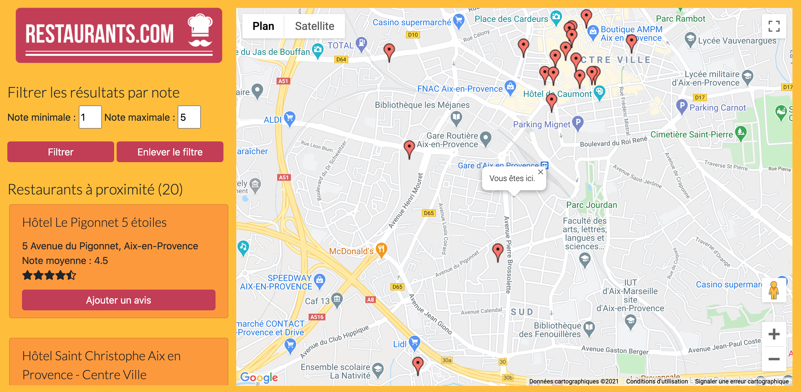

# Site Restaurants.com

The Restaurants.com website allows users to find restaurants near them thanks to Google Maps and Google Places APIs. 
Users can also filter by note the restaurants visible on the map. 

## How to use
Replace YOUR_API_KEY by your actual Google API key in the index.html file

>script src="https://maps.googleapis.com/maps/api/js?key={YOUR_API_KEY}&callback=initMap&libraries=&v=weekly&libraries=places" defer></script

and in the config.js file. 

##Developer
Cécile Prézut